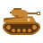
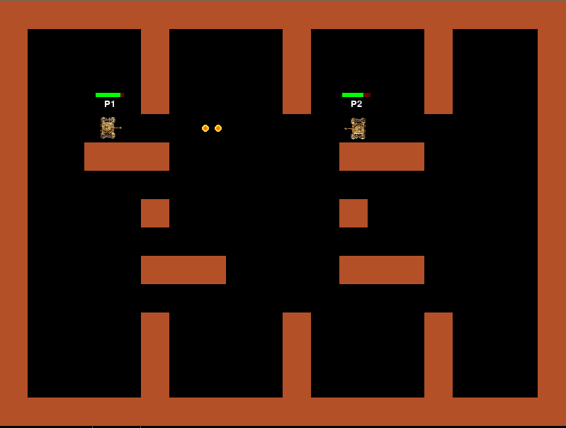

# Tank Battle Game  

## Introduction
A simple 2D tank battle game built with Python using Pygame.
Supports both local multiplayer and online multiplayer (client-server).

 

---

## ⚙️ Install/Run Instructions
### 1. Installation

Clone the repository and set up a virtual environment.

```bash
git clone https://github.com/ZH-J6/Pygame_Software_Engineering.git
cd Pygame_Software_Engineering

# Create virtual environment
python -m venv venv

# Activate (Linux / Mac)
source venv/bin/activate

# Activate (Windows)
venv\Scripts\activate

# Install dependencies
pip install -r requirements.txt
```
### 2. Run the game

### Local mode

```bash
python pygame/game.py
```


### Online mode

- Start server:
```bash
python pygame/server.py
```
- Start clients (in separate terminals):

``` bash
python pygame/client.py Player1
python pygame/client.py Player2
```

You can replace ```Player1```, ```Player2``` with any player name.

---

## 🎮 Play Instructions
- Each player controls a tank and tries to destroy the opponent.
- Shoot bullets to reduce the enemy's HP.
- Each hit deals damage based on the weapon.
- When a player's HP reaches 0, they are destroyed.
- The last surviving player wins.

### 1. Controls

#### 🖥️ Local Mode

Player 1:
- Move: ```W A S D``` 
- Shoot: ```F```

Player 2:
- Move: ```Arrow Keys```  
- Shoot: ```L```

#### 🌐 Online Mode

- Move: ```W A S D``` or ```Arrow Keys```  
- Shoot: ```Space```  


### 2. Tips

- Use walls as cover to avoid bullets.
- Move constantly to dodge enemy shots.
- Aim in the direction you are moving.

### 3. Online Mode Notes

- Each client controls one tank.
- If you are destroyed, the game will close.
- You can reconnect to the server and join again as a new player.

---

## Authors
John Lin / Zhong Ying He

---

## 📂 Project Structure

```text
.
├── pygame/
│   ├── game.py      # Local game loop  
│   ├── server.py    # Multiplayer server 
│   ├── client.py    # Multiplayer client
│   │
│   ├── player.py    # Player logic 
│   ├── bullet.py    # Bullet system  
│   ├── weapon.py    # Weapon system  
│   ├── effects.py   # Visual effects  
│   ├── map.py       # Map generation  
│   ├── setting.py   # Game settings 
│   ├── ui.py
│   │
│   └── assets/
├── requirements.txt
└── README.md
